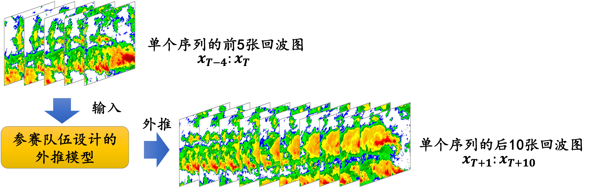

## FREM-Dataset 
For the 1st international "Yuanjian Cup" meta-intelligence data challenge competition -- "Weather Radar Echo Extrapolation"

## 首届国际“远见杯”元智能数据挑战大赛 -- “智慧气象”赛道赛题说明

### 1. 赛题名称
&emsp;&emsp;&emsp;&emsp;&emsp;&emsp; **多普勒天气雷达回波数据外推**

### 2. 赛题简介
&emsp;&emsp;&emsp;&emsp;&emsp;&emsp; 本赛道中，参赛队伍需建立一个准确的天气雷达回波外推模型，输入现有的、按时序排列的多普勒天气雷达回波序列数据，
外推未来时刻的、按时序排列的雷达回波序列数据。

### 3. 功能需求
&emsp;&emsp;&emsp;&emsp;&emsp;&emsp; 如图所示，参赛队伍所设计的外推模型以每个雷达回波图序列的前**5**张图作为输入，输出其之后的**10**张回波图。各参赛队伍的目标是使得模型输出的回波图尽可能和与之对应的真实回波图相似。   
&emsp;&emsp;&emsp;&emsp;&emsp;&emsp; 原始的回波图为的灰度图像，为方便说明，图中的雷达回波图已使用颜色进行填充。

### 4. 数据集说明
&emsp;&emsp;&emsp;&emsp;&emsp;&emsp; 比赛提供某天气雷达体扫所得雷达回波图像，分为Dataset-A和Dataset-B两部分。  
&emsp;&emsp;&emsp;&emsp;&emsp;&emsp; 其中Dataset-A于赛题发布时已上传（包括FREM-Dataset-A1.zip和FREM-Dataset-A2.zip），供各参赛队伍训练及调试设计的模型。  
&emsp;&emsp;&emsp;&emsp;&emsp;&emsp; Dataset-A中包含3250组序列，每个序列共有15张按时间顺序排列的雷达回波图，参赛队伍将每个序列的前5张回波图传给模型，使其输出未来的10张回波图。  
&emsp;&emsp;&emsp;&emsp;&emsp;&emsp; Dataset-B作为测试集，于作品提交截止前3天上传于本仓库，其包含925组回波图序列，每个序列仅提供前5张回波图。  
&emsp;&emsp;&emsp;&emsp;&emsp;&emsp; Dataset-A和Dataset-B中每张回波图大小均为128×128，每个像素点的像素值即表示对应位置的dBZ数值。回波图png文件的读取方法，请参照仓库中的“Read_Example.py”文件。

### 5. 作品提交要求
&emsp;&emsp;&emsp;&emsp;&emsp;&emsp; 对于测试集预测结果，各参赛队伍须严格参照原始数据文件格式，以PNG格式编码，网格点数目、覆盖范围和分辨率须与原来的图像数据相同，覆盖数值范围亦必须符合要求。  
&emsp;&emsp;&emsp;&emsp;&emsp;&emsp; 参赛队伍需建立存储预测数据的压缩包，命名为“Predict.zip”，压缩包内根据测试集的文件夹数量（每个文件夹包含一组图片），建立相同数量的预测数据文件夹。各文件夹名称与FREM-Dataset-B.zip种文件夹名称一致，每个子文件夹内包含10张PNG格式的雷达图（格式与已提供的雷达图一致），分别对应每组测试序列的后10张预测雷达图，文件名分别为“p1.png”、“p2.png”…“p10.png”，如下表所示。最后，参赛队伍将Predict.zip压缩包并提交。   

|FREM-Dataset-B.zip内文件夹名|FREM-Dataset-Predict.zip内文件夹名|Predict.zip内文件夹中的文件名 |  
|--------------------------|-----------------------|----------------------------------|
|sample_1                  |sample_1               |p1.png, p2.png, …, p10.png（共10张）|
|sample_2                  |sample_2               |p1.png, p2.png, …, p10.png（共10张）|
|...                       |...                    |p1.png, p2.png, …, p10.png（共10张）|
|sample_925                |sample_925             |p1.png, p2.png, …, p10.png（共10张）|

### 6. 作品评分标准

&emsp;&emsp;&emsp;&emsp;&emsp;&emsp; 初赛预测结果得分由Critical Success Index(CSI)、Heidke Skill Score(HSS)进行加权衡量，权重系数分别为$w_CSI$、w_{HSS}，具体计算方法如下：
参赛队伍提交的预测图片的每个像素点有效预测数值应在[0,70]区间，然后将由一张真实雷达图和一张对应的预测雷达图组成的一对图片根据{20, 30, 35, 40}这四个阈值，计算hits、miss、false alarm、correct negative四个类别像素点数量。  
&emsp;&emsp;&emsp;&emsp;&emsp;&emsp; 以阈值为20dBZ为例，hits表示预测雷达图中某一像素点数值大于等于20且真实雷达图对应位置像素点数值也大等于于20，这一类像素点数量之和。miss表示预测雷达图中数值小于20，但真实雷达图中对应位置像素点数值大于等于20，这一类像素点数量之和。false alarm表示预测雷达图中数值大于等于20，但真实雷达图中对应位置像素点数值小于20，这一类像素点数量之和。correct negative表示预测雷达图中数值小于20且真实雷达图中对应位置像素点数值小于20，这一类像素点数量之和。
初赛预测结果单张图片根据上述hits、miss、false alarm、correct negative四个类别像素点数量，进一步计算单张图片各阈值下CSI、HSS的数值。此外，考虑到不同预报时效和降雨强度的预测难度，比赛将对评分进行权重调整，预报时间间隔越长、降雨越强，则权重越高（如45阈值下CSI、HSS得分权重高于40阈值下的权重，预测序列第3张回波图权重高于第2张的权重）。所有预测图片的各个阈值得分之和即为该指标最终得分。

